# Two-Wheeled Self-Balancing Car Based on STM32

## Overview
The **Two-Wheeled Self-Balancing Car** is a robotics project designed to maintain balance using an STM32 microcontroller. It uses sensors and control algorithms to stay upright and move smoothly over different terrains.
The car can be controlled remotely using a custom-built app. The app connects to the car via Bluetooth, allowing control of speed, direction, and mode (manual or autonomous).

## Components
- **MCU**: For this project, I opted for the **STM32F407VET6** microcontroller, primarily because of its built-in **DCMI (Digital Camera Interface)** This interface will enable me to connect an OV7670 camera module, for future image processing and video transmission experiments.

- **IMU**: I chose the **MPU6050** - a widely popular 6-axis IMU that comes with a built-in **DMP (Digital Motion Processor)** While diving into various sample codes, I noticed that most implementations bypassed the hardware DMP in favor of software-based calculations. In this project, I ported the official **MPL(Motion Processing Library)** to unlock the full potential of the hardware DMP. This gives us access to advanced features like real-time gyroscope calibration and temperature compensation, though it does cap our sampling rate at ***200Hz***

- **Bluetooth**: I implemented wireless control using an **HC-05** Bluetooth module to establish communication with a mobile controller. Since Android development isn't my strong suit, I leveraged **MIT App Inventor** to create this mobile app. This app not only allows remote control of the balance car but also enables real-time PID parameter tuning.

- **Other components**:   
Power Supply: 12V 3S1300 LiPo battery  
Motor Driver: **AT8236** board (with integrated 12V to 5V conversion)  
Motors: **GM25-370**  
Camera: **OV7670** module  

Below is the hardware structure of this balance car   

      
     <em>Figure 1: Hardware structure of the Balance Car</em>

  

## How It Works
The car uses the MPU6050 sensor to measure the tilt angle. The STM32 microcontroller processes this data using a PID control algorithm to adjust the motor speeds, keeping the car balanced.  
Below is the flowchart of the whole system I created based on my code.

```mermaid
graph TD
    A[Main Program Start] ==> B[Initialize]
    B ==> C[Start Receiving Image]
    C ==> D[Wait for Image<br>Transfer Complete]
    D ==> E[Stop Receiving Image]
    E ==> F[Binary Processing]
    F ==> G[Bluetooth Send Image]
    G ==> H[Wait for Transfer<br>Complete]
    H ==> I[Start Image Reception]
    I ==> D

    J[1ms Timer Interrupt] ======> K[Read Current Timer<br>Count]
    K ==> L[Speed = Timer Count*100*60/<br>Timer Interrupt/min/rad]
    L ==> M[Save Speed Value]
    M ==> N[End]

    O[MPU Data Collection<br>Complete Interrupt] ==> P[Confirm Complete<br>Initialize]
    P ==> Q[Get Previous<br>Time Point]
    P ==> R[Get Current<br>Speed]
    P ==> S[Get Quaternion]
    P ==> T[Get 3-Axis<br>Angular Velocity]
    P ==> U[Get 3-Axis<br>Linear Acceleration]
    Q & R & S & T & U ==> V[MPL Library Data Fusion]
    V ==> W[Get y-Axis Attitude Angles<br>and Angular Velocity]
    V ==> Y[Get z-Axis<br>Angular Acceleration]
    X[Get Speed<br>from encoder] ==> CC[Balance, Speed, Direction PID Controllers]
    W ==> CC
    Y ==> CC
    Z[Balance Point<br>Target Direction Angle<br>Target Speed<br>PID Parameters] ==>CC
    CC ==> DD[Output PWM = Balance PWM - Speed PWM ± Direction PWM]
    DD ==> EE[Left/Right Motor Output PWM]
    EE ==> FF[Bluetooth Send Parameters Info]
    FF ==> GG[End]

    HH[Bluetooth Reception<br>Interrupt] ==> II{Judge Message Type}
    II ==> JJ[Parameter Type]
    II ==> KK[Control Type]
    JJ ==> LL[Bkp, Bkd, Vkp, Vki,<br>Tkp, Tkd]
    KK ==> MM{Command Type}
    MM ==> NN[Direction<br>Command]
    MM ==> OO[Forward/Back<br>Command]
    MM ==> PP[Mechanical Zeroing<br>Command]
    MM ==> QQ[Stop Command]
    NN ==> RR[Change Target <br> Direction Angle]
    OO ==> SS[Change Target<br>Speed]
    PP ==> TT[Change Balance<br>Point]
    QQ ==> UU[Target Speed = 0,<br>Direction Angle = 0,<br>Balance Point = Default]
    LL & RR & SS & TT & UU ==> VV[Save Modified Values] 
    VV ==> WW[End]

    style A fill:#309B0F,stroke:#333,stroke-width:2px
    style J fill:#C47D0F,stroke:#333,stroke-width:2px
    style O fill:#C47D0F,stroke:#333,stroke-width:2px
    style HH fill:#C47D0F,stroke:#333,stroke-width:2px
    style N fill:#F14C26,stroke:#333,stroke-width:2px
    style GG fill:#F14C26,stroke:#333,stroke-width:2px
    style WW fill:#F14C26,stroke:#333,stroke-width:2px
    style M stroke:#0ff
    style VV stroke:#ff0
    style X stroke:#0ff
    style Z stroke:#ff0

```  

*Figure 2: System Flowchart of the Balance Car*

## Video Demonstration
Watch the video below to see the **Two-Wheeled Self-Balancing Car** in action:

https://github.com/user-attachments/assets/efbfce62-da7c-4999-a8f2-9c50a812b0b7

https://github.com/user-attachments/assets/f8b946de-f671-4c50-9264-caaa95a979a5

## Future Improvements
- **Advanced Control Algorithm**: This small vehicle was my first project when I began learning automatic control theory. The control algorithm used is relatively simple, consisting only of a speed-loop PID. Fortunately, this was enough to get it balanced. In the future, I plan to upgrade it to a cascade PID control for better performance and stability.
- **Motor Upgrade to FOC**: To quickly validate the functionality, I initially used a basic combination of a brushed DC motor with an encoder. However, I am particularly interested in brushless DC motors and Field-Oriented Control (FOC). While I haven't had the opportunity to explore this yet, I plan to replace the current motor setup with FOC when time permits.
- **Image Processing and Transmission**: The project currently reads images into memory and performs basic image processing, but no related functionalities were added. In the future, I plan to implement like line-following algorithms or add a WiFi module for image transmission.
- **Mobile App for Remote Monitoring**: The current mobile interface, developed using MIT App Inventor, which is basic, serves its purpose though. Moving forward, I aim to develop a more sophisticated app, possibly as a mini-program, to enable remote monitoring and control.

## Image Gallery

    

        
        
    

    

        
<em>Figure 3: Front View of the Balance Car</em>

        
<em>Figure 4: Back View of the Balance Car</em>

    

     
     <em>Figure 5: App Interface</em>

## Contact Information
For more information or to collaborate, please contact:
- **Email**: chenruifeng02@outlook.com
- **LinkedIn**: [Chenrui Feng](https://www.linkedin.com/in/chenrui-feng-244330335/)

